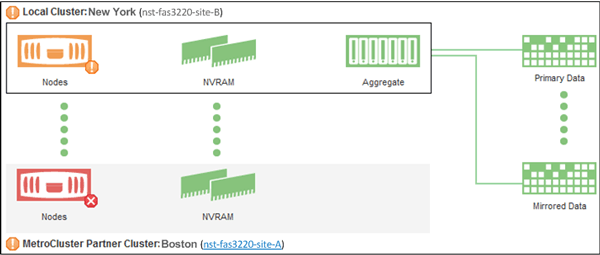

= 檢查MetroCluster 叢集的健全狀況、以進行整體配置
:allow-uri-read: 
:icons: font
:imagesdir: ../media/

[role="lead"]
您可以使用Active IQ Unified Manager 功能不整合管理程式（Unified Manager）來檢查叢集及其元件的運作健全狀況MetroCluster 、包括透過FC MetroCluster 和透過IP進行的功能不整組態。如果叢集涉及Unified Manager偵測到的效能事件、健全狀況狀態可協助您判斷是否有硬體或軟體問題導致事件發生。

*您需要的是什麼*

* 您必須具有「操作員」、「應用程式管理員」或「儲存管理員」角色。
* 您必須分析MetroCluster 一項效能事件以進行不完整的組態設定、並取得相關叢集的名稱。
* 透過FC和IP進行的靜態組態中的兩個叢集MetroCluster 、都必須由Unified Manager的相同執行個體監控。

== 判斷MetroCluster 叢集健全狀況的功能

請遵循下列步驟、以MetroCluster 透過功能不全的FC組態來判斷叢集健全狀況。

.步驟
. 在左側導覽窗格中、按一下*事件管理*以顯示事件清單。
. 在篩選面板中、選取MetroCluster 「*來源類型*」類別下的所有「資訊篩選器」。您會看到環境中所有MetroCluster 的資訊不全的組態事件。
. 在某個事件旁、按一下叢集的名稱。MetroCluster
+
[NOTE]
====
如果未MetroCluster 顯示任何動態、您可以使用搜尋列來搜尋與MetroCluster 您的FC組態相關的事件所涉及的叢集名稱。

====
+
「健全狀況：所有叢集」檢視畫面會顯示事件的詳細資訊。

. 選取* MetroCluster 《鏈接能力*》索引標籤、以顯示所選叢集與其合作夥伴叢集之間連線的健全狀況。
+
image::../media/opm_um_mcc_connectivity_tab_png.gif[Unified Manager MetroCluster 的「連線能力」標籤]

+
在此範例中、會顯示本機叢集及其合作夥伴叢集的名稱和元件。黃色或紅色圖示表示反白顯示元件的健全狀況事件。連線功能圖示代表叢集之間的連結。您可以將滑鼠游標指向圖示以顯示事件資訊、或按一下圖示以顯示事件。任一叢集上的健全狀況問題、可能已導致效能事件。

+
Unified Manager會監控叢集之間連結的NVRAM元件。如果本機或合作夥伴叢集上的FC交換器圖示或連線圖示為紅色、則可能是因為連結健全狀況問題而導致效能事件。

. 選擇* MetroCluster 《Replication》（*《複製》）*標籤。
+

+
在此範例中、如果本機或合作夥伴叢集上的NVRAM圖示為黃色或紅色、則NVRAM的健全狀況問題可能會導致效能事件。如果頁面上沒有紅色或黃色圖示、表示合作夥伴叢集上的效能問題可能導致效能事件。

== 判斷MetroCluster 叢集健全狀況的透過IP進行設定

請依照下列步驟、以MetroCluster 透過IP位址進行的功能組態來判斷叢集健全狀況。

.步驟
. 在左側導覽窗格中、按一下*事件管理*以顯示事件清單。
. 在篩選面板的*來源類型*類別下、選取 `MetroCluster Relationship` 篩選器：您會看到環境中所有MetroCluster 的資訊不全的組態事件。
+
[NOTE]
====
如果您看不到回報MetroCluster 的資訊事件、可以使用搜尋列、根據與MetroCluster 您的IP組態相關的事件所涉及的叢集名稱進行搜尋。

====
. 在相關MetroCluster 的事件旁、按一下叢集名稱。此時會顯示「叢集」頁面、其中包含該叢集的詳細資料。如需判斷健全狀況問題的相關資訊、請參閱 link:../storage-mgmt/task_monitor_metrocluster_configurations.html["監控MetroCluster 透過IP組態的連線問題"]。

