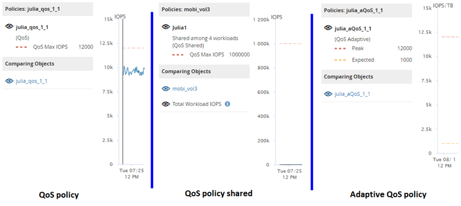

= 處理量圖表中顯示不同類型的QoS原則
:allow-uri-read: 
:icons: font
:imagesdir: ../media/

[role="lead"]
您可以在Performance Explorer中檢視ONTAP定義的服務品質（QoS）原則設定、以及工作負載分析IOPS、IOPS/TB和MB/s圖表中、檢視已套用至磁碟區或LUN的設定。圖表中顯示的資訊會因套用至工作負載的QoS原則類型而有所不同。

處理量上限（或「尖峰」）設定可定義工作負載可耗用的最大處理量、進而限制對系統資源競爭工作負載的影響。處理量下限（或「預期」）設定可定義工作負載必須具備的最低處理量、使關鍵工作負載無論競爭工作負載的需求為何、都能達到最低處理量目標。

IOPS和MB/s的共享和非共享QoS原則使用「最小」和「最大」兩詞來定義樓層和上限。針對IOPS/TB的調適性QoS原則（在ONTAP 《》9.3中推出）、使用「Exp意料 之中」和「尖峰」兩詞來定義樓層和上限。

雖然利用VMware可建立這兩種QoS原則、但根據它們在工作負載上的套用方式、QoS原則有三種顯示方式會顯示在效能圖表中。ONTAP

|===
| 原則類型 | 功能 | Unified Manager介面中的指標 

 a| 
指派給單一工作負載的QoS共用原則、或指派給單一工作負載或多個工作負載的QoS非共用原則
 a| 
每個工作負載都會耗用指定的處理量設定
 a| 
顯示「（QoS）」

 a| 
指派給多個工作負載的QoS共用原則
 a| 
所有工作負載都會共用指定的處理量設定
 a| 
顯示「（QoS共享）」

 a| 
指派給單一工作負載或多個工作負載的調適性QoS原則
 a| 
每個工作負載都會耗用指定的處理量設定
 a| 
顯示「（QoS調適性）」

|===
下圖顯示三個選項如何顯示在計數器圖表中的範例。

當工作負載的IOPS/TB圖表中出現以IOPS定義的一般QoS原則時、ONTAP 將IOPS值轉換為IOPS/TB值、而Unified Manager會在IOPS/TB圖表中顯示該原則、並顯示「QoS、以IOPS定義」文字。

在工作負載的IOPS圖表中顯示以IOPS/TB定義的調適性QoS原則時ONTAP 、將IOPS/TB值轉換為IOPS值、而Unified Manager會在IOPS圖表中顯示該原則、並顯示「QoS調適性-已使用、 定義單位為IOPS/TB'或「QoS調適性-已分配、定義單位為IOPS/TB」、視IOPS分配尖峰設定的設定方式而定。當分配設定設為「分配空間」時、尖峰IOPS會根據磁碟區的大小來計算。當分配設定設為「已用空間」時、尖峰IOPS會根據儲存在磁碟區中的資料量來計算、並考量儲存效率。

[NOTE]
====
IOPS/TB圖表只會在磁碟區使用的邏輯容量大於或等於128 GB時顯示效能資料。當所選時間範圍內使用的容量低於128 GB時、會在圖表中顯示落差。

====