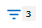

= 篩選「物件庫存管理效能」頁面中的資料
:allow-uri-read: 
:icons: font
:imagesdir: ../media/

[role="lead"]
您可以篩選「物件庫存管理效能」頁面中的資料、以便根據特定條件快速找到資料。您可以使用篩選功能來縮小「物件庫存管理效能」頁面的內容、只顯示您指定的結果。這是一種非常有效率的方法、只顯示您感興趣的效能資料。

您可以使用「篩選」面板、根據偏好自訂網格檢視。可用的篩選選項取決於在網格中檢視的物件類型。如果目前已套用篩選、則「篩選」按鈕右側會顯示套用的篩選數目。

支援三種篩選參數。

|===
| 參數 | 驗證 

 a| 
字串（文字）
 a| 
運算子為* contain*、*開頭為*、*結尾為*、*不包含*。

 a| 
數量
 a| 
運算子為*大於*、*小於*、*在最後*、*介於*。

 a| 
列舉（文字）
 a| 
運算子為* is *、* is not *。

|===
每個篩選都需要欄、運算子和值欄位；可用的篩選會反映目前頁面上的可篩選欄。您可以套用的篩選數目上限為四個。篩選的結果是以合併的篩選參數為基礎。篩選的結果會套用至篩選搜尋中的所有頁面、而不只是目前顯示的頁面。

您可以使用「篩選」面板新增篩選條件。

. 在頁面頂端、按一下*篩選*按鈕。此時會顯示「篩選」面板。
. 按一下左下拉式清單、然後選取物件、例如_Cluster_或效能計數器。
. 按一下中央下拉式清單、然後選取您要使用的運算子。
. 在最後一個清單中、選取或輸入值以完成該物件的篩選。
. 若要新增其他篩選器、請按一下「*+新增篩選器*」。此時會顯示額外的篩選欄位。請使用上述步驟中所述的程序來完成此篩選器。請注意、新增第四個篩選器後、「+新增篩選器*」按鈕將不再顯示。
. 按一下「*套用篩選條件*」。篩選選項會套用至網格、篩選數目會顯示在「篩選」按鈕的右側。
. 按一下要移除之篩選右側的垃圾桶圖示、即可使用「篩選」面板移除個別篩選。
. 若要移除所有篩選條件、請按一下篩選面板底部的*重設*。

== 篩選範例

下圖顯示篩選面板包含三個篩選器。當篩選器數量少於最多四個時、便會顯示「+新增篩選器*」按鈕。

image::../media/opm_filtering_panel_draft_3.gif[UI 螢幕擷取畫面、顯示包含三個篩選器的篩選面板。]

按一下「*套用篩選器*」之後、「篩選」面板會關閉、套用您的篩選器、並顯示套用的篩選器數量（）。
