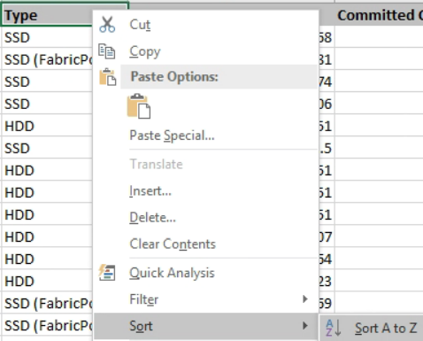

= 建立報告以顯示總計與可用容量圖表
:allow-uri-read: 
:icons: font
:imagesdir: ../media/

[role="lead"]
您可以建立報告、以Excel圖表格式分析儲存設備總容量和已提交容量。

*您需要的是什麼*

* 您必須具有應用程式管理員或儲存管理員角色。

請使用下列步驟開啟健全狀況：所有集合體檢視、在Excel中下載檢視、建立總容量和已提交容量圖表、上傳自訂的Excel檔案、以及排程最終報告。

.步驟
. 在左導覽窗格中、按一下「*儲存設備*>* Aggregate *」。
. 選擇*報告*>*下載Excel *。
+
image::../media/download_excel_menu.png[下載Excel功能表]

+
視瀏覽器而定、您可能需要按一下*確定*來儲存檔案。

. 在Excel中開啟下載的檔案。
. 如有需要、請按一下*啟用編輯*。
. 在資料表上、以滑鼠右鍵按一下「Type（類型）」欄、然後選取「* Sort*（排序）」>「* Sorting A to Z*（排序A到Z*）
+

+
這會依儲存類型來排列資料、例如：

+
** HDD
** 混合式
** SSD
** SSD（FabricPool 僅限部分）

. 選取「Type（類型）」、「Total Data Capacity（總資料容量）」和「Available Data Capacity（可用資料容量）」欄。
. 在*插入*功能表上、選取「3D資料欄」圖表。
+
圖表會出現在資料表上。

+
image::../media/3d_column_01.png[3D欄01]

. 在圖表上按一下滑鼠右鍵、然後選取*移動圖表*。
. 選擇* New sheet *（新工作表）並命名工作表* Total Storage Chart*（總儲存圖表*）。
+
[NOTE]
====
請確定新的工作表出現在資訊和資料表之後。

====
. 請將圖表標題命名為*總容量與可用容量*。
. 使用*設計*和*格式*功能表（在選取圖表時可用）、您可以自訂圖表的外觀。
. 如果滿意、請將檔案與變更一起儲存。請勿變更檔案名稱或位置。
+
image::../media/total_vs_available_capacity.png[總容量與可用容量]

. 在Unified Manager中、選取* Reports*>*上傳Excel *。
+
[NOTE]
====
請確定您的檢視方式與下載Excel檔案的位置相同。

====
. 選取您已修改的Excel檔案。
. 按一下「*開啟*」。
. 按一下*提交*。
+
「*報告*>*上傳Excel *」功能表項目旁邊會出現核取符號。

+
image::../media/upload_excel.png[上傳Excel]

. 按一下*排程報告*。
. 按一下「*新增排程*」將新列新增至「*報告排程*」頁面、以便定義新報告的排程特性。
+
[NOTE]
====
選取報告的* XLSX*格式。

====
. 輸入報告排程的名稱並填寫其他報告欄位、然後按一下核取符號（image:../media/blue_check.gif[""]）。
+
報告會立即以測試形式傳送。之後、報告會以電子郵件產生並傳送給使用指定頻率列出的收件者。

根據報告中顯示的結果、您可能需要平衡集合體上的負載。
