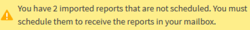

= 排程匯入的.rptDesign報告
:allow-uri-read: 
:icons: font
:imagesdir: ../media/

[role="lead"]
您可以排程在舊版Unified Manager中建立和匯入的現有報告。

排程匯入的報告需要下列項目：

* 在舊版Unified Manager中匯入的BIRT設計.rptdesign檔案報告
* 適用於升級至Unified Manager 9.6 GA或更新版本

升級至Unified Manager 9.6 GA或更新版本之後、「報告排程」頁面會列出匯入的報告。您可以編輯這些報告的排程、以指定收件者電子郵件地址、頻率和格式（PDF或CSV）。否則無法在Unified Manager UI中編輯或檢視這些報告。

.步驟
. 開啟「報告排程」頁面。如果您已匯入報告、則會出現訊息。
+

. 按一下*檢視*名稱以顯示用於產生報告的SQL查詢。
+
image::../media/importedreport1.png[顯示用於產生報告的 SQL 查詢的 UI 螢幕擷取畫面。]

. 按一下「更多」圖示 image:../media/more_icon.gif[""]、按一下*編輯*、定義報告排程詳細資料、然後儲存報告。
+
[NOTE]
====
您也可以從「更多」圖示刪除任何不想要的報告 image:../media/more_icon.gif[""]。

====

