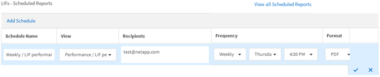

= 排程報告
:allow-uri-read: 
:icons: font
:imagesdir: ../media/

[role="lead"]
當您有想要排程定期產生和發佈的檢視或Excel檔案之後、就可以排程報告。

*您需要的是什麼*

* 您必須具有應用程式管理員或儲存管理員角色。
* 您必須在「*一般*>*通知*」頁面中設定了「SMTP伺服器」設定、以便報告引擎能將報告作為電子郵件附件、傳送到Unified Manager伺服器的收件者清單。
* 電子郵件伺服器必須設定為允許附件隨產生的電子郵件一起傳送。

請使用下列步驟來測試及排程要為檢視產生的報告。選取或自訂您要使用的檢視。下列程序使用網路檢視來顯示網路介面效能、但您可以使用任何想要的檢視。

.步驟
. 開啟您的檢視。此範例使用預設的網路檢視來顯示LIF效能。在左導覽窗格中、按一下*網路>網路介面*。
. 使用內建的Unified Manager功能、視需要自訂檢視。
. 自訂檢視之後、您可以在*檢視*欄位中提供唯一名稱、然後按一下核取標記加以儲存。
+
image::../media/view_save.gif[檢視儲存]

. 您可以使用Microsoft®Excel的進階功能來自訂報告。如需詳細資訊、請參閱 link:task_use_excel_to_customize_your_report.html["使用Excel自訂您的報告"]。
. 若要在排程或分享之前查看輸出：
+
[cols="2*"]
|===
| 選項 | 說明 

 a| 
*如果您使用Excel自訂報告*
 a| 
檢視現有下載的Excel檔案。

 a| 
*如果您未使用Excel自訂報告*
 a| 
下載* CSV*、* PDF*或* XLSX*檔案格式的報告。

|===
+
使用已安裝的應用程式開啟檔案、例如Microsoft Excel（CSV/xslx）或Adobe Acrobat（PDF）。

. 如果您對報告滿意、請按一下*排程報告*。
. 在「報告排程」頁面中、按一下*「新增排程」*。
. 接受預設名稱（檢視名稱與頻率的組合）、或自訂*排程名稱*。
. 若要第一次測試排程的報告、請僅將自己新增為*收件者*。如果滿意、請新增所有報告收件者的電子郵件地址。
. 指定產生報告並傳送給收件者的頻率。您可以選擇*每日*、*每週*或*每月*。
. 選擇* PDF*、* CSV*或* xslx*格式。
+
[NOTE]
====
對於您使用Excel自訂內容的報告、請務必選取* xslx*。

====
. 按一下核取符號（image:../media/blue_check.gif[""]）以儲存報告排程。
+

+
報告會立即以測試形式傳送。之後、報告會以電子郵件產生並傳送給使用排程頻率列出的收件者。

